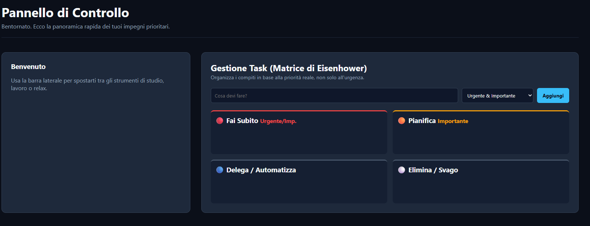
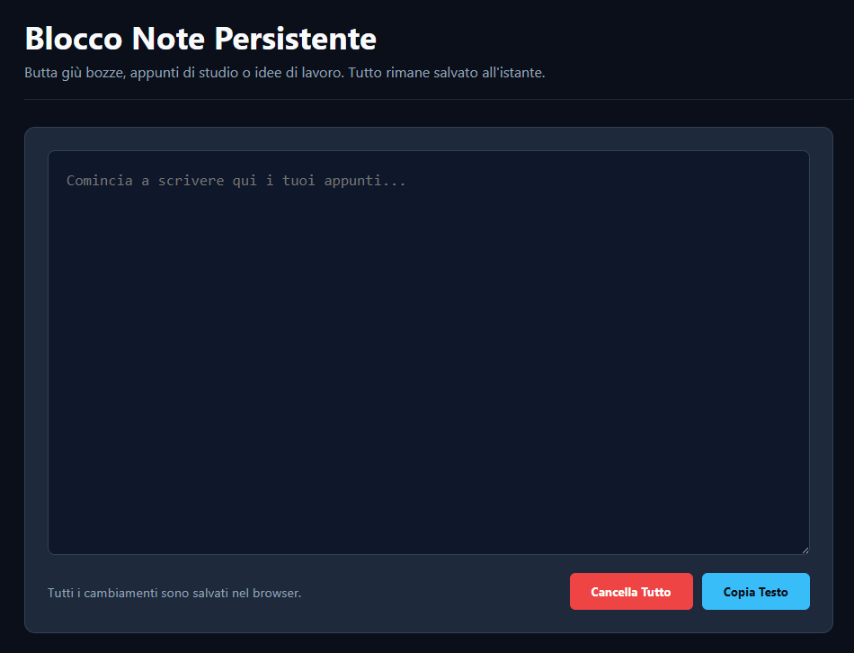

# ZenithOS 🚀


**ZenithOS** is a personal, all-in-one productivity workspace designed with a dark, minimal, and futuristic aesthetic. It centralizes everything you need into a single local command center to optimize your computer study and work sessions.

🎯 **[Live Demo — Try ZenithOS Now!](https://YOUR_GITHUB_USERNAME.github.io/zenithos/)**

*(Note: Replace `YOUR_GITHUB_USERNAME` in the link above with your actual GitHub username!)*

---

## 📸 Screenshots

### 🏠 Operations Center (Home Dashboard)

*Task management based on the Eisenhower Matrix.*

### 📝 Fluid Notepad & Media Hub

*Quick-writing area with automatic saving alongside the integrated audio player.*

---

## ✨ Key Features

*   **Operations Center (Home):** Advanced task management based on the Eisenhower Matrix to instantly sort activities by Urgency and Importance.
*   **Break & Focus:** Integrated Pomodoro timer to manage work cycles, paired with built-in stress-relieving mini-games for your breaks.
*   **Fluid Notepad:** A seamless quick-writing area with real-time automatic saving (`localStorage`) and instant text file downloads.
*   **Utility Board:** A dynamic, categorized bookmark manager to keep your essential work links always within reach.
*   **Media & Food Hub:** Integrated background ambient audio players and ultra-fast optimization shortcuts for food delivery apps (Glovo & Deliveroo).

---

## 🛠️ Tech Stack & Philosophy

*   **Frontend:** Pure HTML5, Semantic CSS3 variables, Vanilla JavaScript (ES6+).
*   **Animations:** Smooth cinematic page transitions powered by **GSAP (GreenSock Animation Platform)**.
*   **Zero Setup / Privacy First:** No database overhead, no external servers, and no tracking. All data remains 100% private, saved instantly inside your browser's local storage.
*   **Performance:** Ultra-lightweight architecture yielding near-instantaneous (0.1s) loading speeds.

---

## 🚀 How to Run Locally

If you want to run this project on your machine without internet access:

1. Clone the repository:
   ```bash
   git clone [https://github.com/YOUR_GITHUB_USERNAME/zenithos.git](https://github.com/YOUR_GITHUB_USERNAME/zenithos.git)
